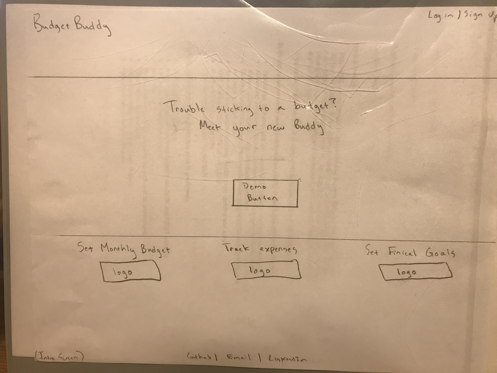
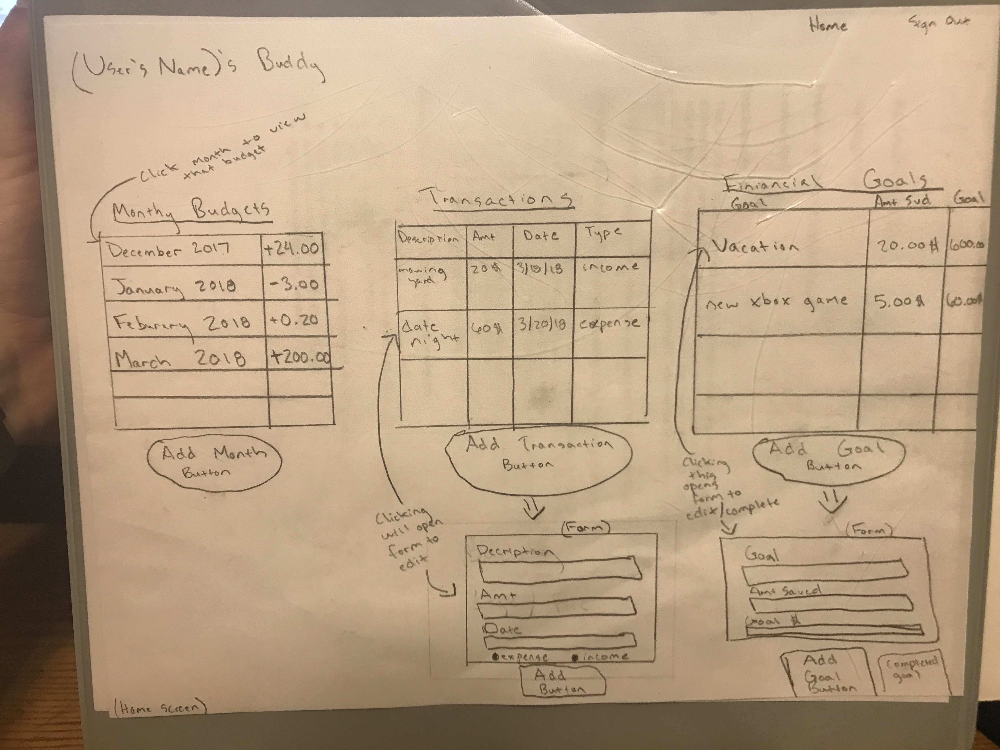
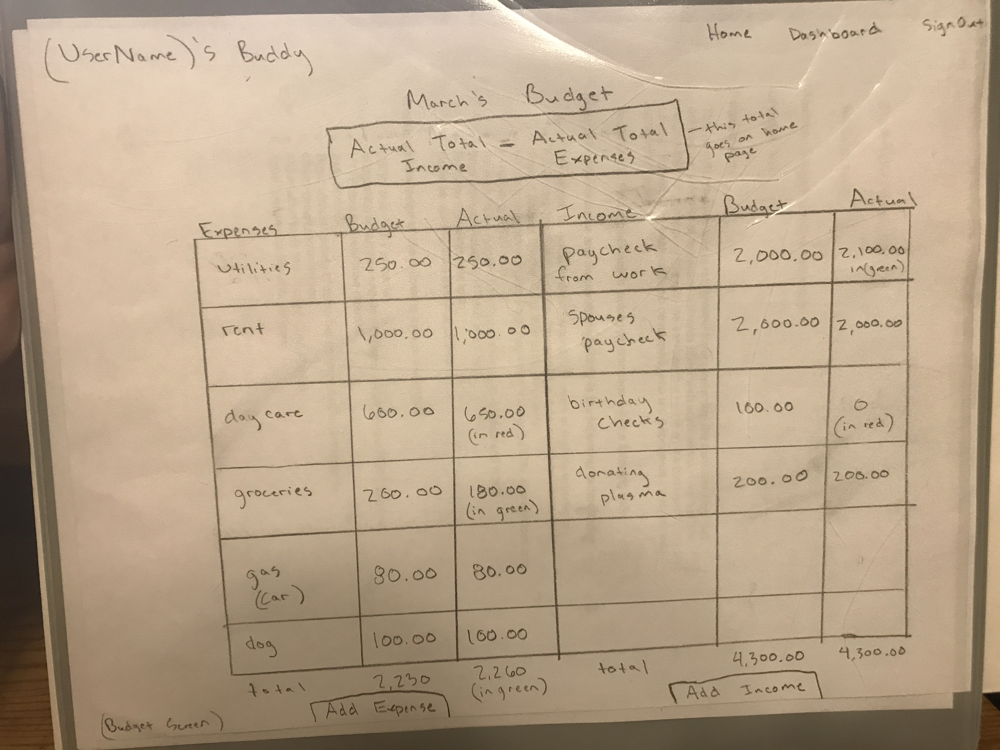

# recipe-node-capstone
The purpose of this app is to make budgeting fun, by helping the user plan their financial goals, and track their expenses in order to meet those goals.

# MVP workflow

### Intro Screen
* -->
* ---->
* ------>
### Home Screen
* -->
* ---->
* ------>
* -------->
* ---------->
* ------------>
###  Budget Screen
* -->
* ---->
* ------>
* -------->
* ---------->
* ------------>
###
* -->
* ---->
* ------>
* -------->
* ---------->
* ------------>

# User Stories
* As a user I want to

* As a user I want to

* As a user I want to

* As a user I want to

* As a user I want to

# Screenshots

# Working Prototype
Find a working prototype with Node at https://budget-buddy-react-capstone.herokuapp.com/

# Functionality
* When the user brings up the
* The user then
* The user can
* The user can
* The user can
* The user can

# Technical

### Front End
* HTML5
* CSS3
* JavaScript
* jQuery
* React
* Redux

### Back End
* Node.js with Heroku implementation
* Express.js
* MongoDB on mLab
* Mongoose
* Mocha and Chai
* React
* Redux

# Responsive
The app is responsive and optimized for both desktop and mobile viewing and use.

# API Documentation
### API endpoints for the back end include:

* POST to '' for
* POST to '' to
* POST to '' for
* PUT to '' to
* GET to '' to
* DELETE to '' to
# Development Roadmap

### Planned additional features and improvements will allow users to:

####
*

####
*
